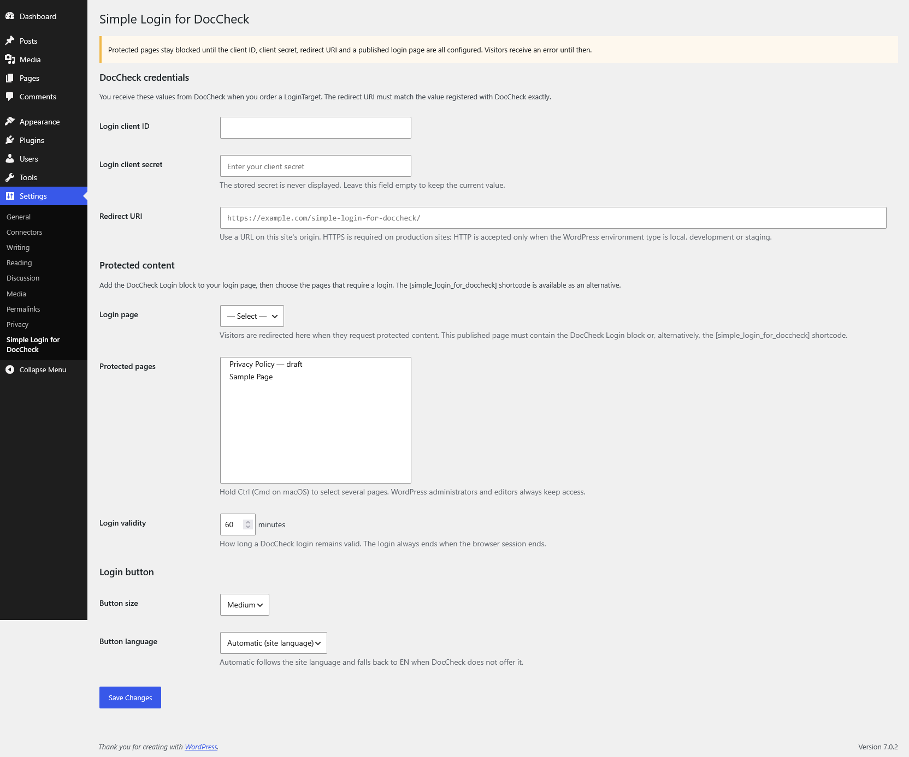

# Simple Login for DocCheck

WordPress plugin that protects selected content with a [DocCheck](https://www.doccheck.com/) OAuth 2.0 login.

[](https://github.com/dotsunited/simple-login-for-doccheck/actions/workflows/lint.yml)
[](LICENSE)

## Requirements

| | |
|---|---|
| WordPress | 6.3+ |
| PHP | 8.0+ with sessions enabled and a writable `session.save_path` |
| DocCheck | LoginTarget with client ID and secret |

## Installation

Install a [release archive](https://github.com/dotsunited/simple-login-for-doccheck/releases) through **Plugins → Add New → Upload Plugin**, or use Composer:

```bash
composer require dotsunited/simple-login-for-doccheck
```

For development, clone this repository into `wp-content/plugins/` and run `composer install` to generate the autoloader. Official release archives include the production autoloader and require no build step after installation.

## Setup

1. Create an **OAuth 2.0 / OpenID Connect** LoginTarget in the [DocCheck Login Manager](https://login.doccheck.com/).
2. Create a WordPress page, add the **DocCheck Login** block, and publish it.
3. Open **Settings → Simple Login for DocCheck** and configure:



| Setting | Purpose |
|---|---|
| Login client ID / secret | Credentials from DocCheck. An empty secret field keeps the stored value. |
| Redirect URI | Exact callback URL registered with DocCheck on the same origin as the WordPress home URL. HTTPS is required in production. |
| Login page | Published page containing the DocCheck Login block or shortcode alternative. |
| Protected pages | Pages requiring a DocCheck login. |
| Login validity | Session lifetime in minutes; default `60`. |
| Button size | `small`, `medium`, or `large`. |
| Button language | `auto`, `de`, `en`, `fr`, `es`, `it`, or `nl`. |

Protected pages return `503` until the credentials, redirect URI, and login page are valid. WordPress administrators and editors retain access.

## Usage

Add the **DocCheck Login** block in the WordPress block editor. The block uses the configured button size and language by default; both can be overridden in the block settings. `auto` follows the WordPress locale and falls back to English.

The shortcode remains available as an alternative for the classic editor, templates, and other contexts where blocks are not suitable:

```text
[simple_login_for_doccheck]
[simple_login_for_doccheck size="large" language="en"]
```

The shortcode also uses the configured size and language by default.

Check the login state in PHP:

```php
$is_authenticated = function_exists( 'simple_login_for_doccheck' )
	&& simple_login_for_doccheck()->auth()->is_authenticated();
```

### Protected content in listings

Protected entries remain visible in menus, search, archives, feeds, sitemaps, and REST responses. Anonymous visitors can see listing metadata, but not body content; direct requests redirect to the login page.

Full-object `WP_Query` or `get_posts()` calls with `suppress_filters` enabled omit protected entries because their bodies cannot be redacted. ID-only results remain available.

## Plan support and security

DocCheck Basic, Economy, and Business LoginTargets are supported. The plugin only verifies a successful login; access tokens, personal data, and plan-specific identity data are not stored.

DocCheck Basic does not return OAuth `state`, so the plugin neither sends nor verifies it. The server-to-server authorization-code exchange verifies the login. Without `state`, another site can cause a visitor's browser to complete a login it did not initiate; this only gives that visitor access to protected content. Use a different integration if your threat model requires a `state`-bound flow.

## External services

This plugin relies on DocCheck as an external authentication service:

- **DocCheck CDN** (`https://dccdn.de`): When a page containing the DocCheck Login block or `[simple_login_for_doccheck]` shortcode is rendered, the visitor's browser loads the DocCheck login-button web component from the CDN. This request may transmit technical data such as the visitor's IP address, user agent, and referrer to DocCheck before the button is clicked.
- **DocCheck OAuth service** (`https://auth.doccheck.com`): When a visitor starts the login flow, the visitor's browser connects to DocCheck for authentication. On the callback, the WordPress server sends the authorization code, client ID, client secret, and configured redirect URI to DocCheck's token endpoint to verify the login.

The plugin discards the returned access token and does not request or store DocCheck profile data. It stores only the local login expiry and return URL in the visitor's PHP session.

Review the [DocCheck Login documentation](https://docs.doccheck.com/login-access/), [DocCheck Privacy Policy](https://more.doccheck.com/en/privacy), and [DocCheck Login Usage and Licence Agreement](https://more.doccheck.com/en/terms-of-use-license/) before enabling the integration.

## Hooks

### Filters

| Filter | Arguments / result |
|---|---|
| `simple_login_for_doccheck_protected_page_ids` | `int[] $ids` |
| `simple_login_for_doccheck_is_page_protected` | `bool $protected, int $post_id` |
| `simple_login_for_doccheck_page_url` | `string $url, int $page_id` |
| `simple_login_for_doccheck_return_url` | `string $url` |
| `simple_login_for_doccheck_is_authenticated` | `bool $valid, int $expires_at` |
| `simple_login_for_doccheck_button_language` | `string $language` |
| `simple_login_for_doccheck_token_endpoint` | `string $endpoint` |
| `simple_login_for_doccheck_block_html` | `string $html, array $attributes` |
| `simple_login_for_doccheck_shortcode_html` | `string $html, array $atts` |
| `simple_login_for_doccheck_error_message` | `string $message` |

`simple_login_for_doccheck_is_page_protected` runs once per matching post and request. Keep callbacks fast and side-effect free; nested queries are supported.

### Actions

| Action | Arguments |
|---|---|
| `simple_login_for_doccheck_authenticated` | None |
| `simple_login_for_doccheck_failed` | `WP_Error $error` |

Example: protect descendants of page `1234`:

```php
add_filter(
	'simple_login_for_doccheck_is_page_protected',
	function ( $protected, $post_id ) {
		return $protected || in_array( 1234, get_post_ancestors( $post_id ), true );
	},
	10,
	2
);
```

## Caching

Sessions start only for a protected redirect or callback. Direct protected responses and authenticated listings containing protected bodies send no-cache headers.

- Exclude protected pages and the login page from full-page caches.
- Do not cache responses carrying a session cookie.

## Development

```bash
composer install
composer run-script check
```

See [CONTRIBUTING.md](CONTRIBUTING.md) for contribution and release instructions.

## License

[GPL-2.0-or-later](LICENSE) © [Dots United GmbH](https://dotsunited.de/)

DocCheck is a trademark of DocCheck Community GmbH. This plugin is not affiliated with or endorsed by DocCheck.
